# Muressons Global Command — Runtime Dependency Map

> **Purpose**: Developer reference for the live runtime dependency graph.
> Use this when adding new modules, refactoring imports, or deciding where new features belong.
>
> **Last updated**: 2026-07-08
> **Methodology**: Full static import-chain trace from `backend/main.py`, verified against all `.py` files.

---

## Quick Reference: Is My File a Runtime Dependency?

Before adding or moving a file, check this simple rule:

```
If it appears in the "Core Runtime Set" or "Extended Engine Modules" tables below
→ it is a LIVE DEPENDENCY. Renaming, moving, or deleting it will break the server.

If it does not appear in those tables
→ it is a standalone script (safe to move/archive without impacting the running app).
```

---

## Application Entry Point

```
backend/main.py
```

**Startup sequence:**
1. Reads `USE_MEMORY_DB` env var — selects `database.py` (PostgreSQL) or `database_memory.py` (in-memory)
2. Injects selected db module as `sys.modules["database"]` so all routers share the same backend
3. Imports and mounts 5 routers: `router`, `admin_router`, `teleprompter_router`, `resources_router`, `analytics_router`
4. Configures CORS, security headers middleware, and lifespan (pool open/close + cohort seeding)

---

## Layer 1 — Routers (mounted by main.py)

| Router File | Mount Point | Key Responsibilities |
|-------------|-------------|----------------------|
| `router.py` | `/api/*` | All player-facing simulation endpoints (tick, login, decisions, stakeholder map, CEO interview, etc.) |
| `admin_router.py` | `/api/admin/*` | Facilitator + God Mode admin endpoints; WebSocket broadcast manager |
| `admin_teleprompter.py` | `/api/admin/teleprompter/*` | Live teleprompter/slide presentation endpoints |
| `admin_resources.py` | `/api/admin/resources/*` | File upload/download, quiz bank management |
| `admin_analytics.py` | `/api/admin/analytics/*` | Session analytics, score aggregation |

---

## Layer 2 — Core Infrastructure (imported by routers)

```
main.py
├── database.py          ← PostgreSQL backend (asyncpg pool)
│   └── config.py
├── database_memory.py   ← In-memory fallback (thread-safe dict store)
│   └── config.py
├── config.py            ← All env vars: DATABASE_URL, MASTER_PASSWORD, SIM_ROUNDS, etc.
├── admin_shared.py      ← Shared in-process state: _facilitator_registry, _god_mode_settings
│   └── config.py
├── router.py
│   ├── database (injected)
│   ├── materiality_db.py  ← JSON-backed materiality issue store (no DB connection)
│   ├── engine.py
│   ├── round_logic.py
│   ├── round_configs.py
│   ├── pillar_configs.py
│   ├── config.py
│   ├── admin_router.py    (shared helpers: require_facilitator, _check_rate_limit, etc.)
│   ├── password_hashing.py
│   ├── admin_resources.py (shared helper: check_hidden_resource_triggers)
│   ├── admin_shared.py
│   ├── option_shuffle.py
│   ├── models.py
│   ├── round2_csrd.py
│   ├── stakeholder_map.py
│   └── [all Extended Engine Modules — see Layer 3]
├── admin_router.py
│   ├── database (injected)
│   ├── materiality_db.py
│   ├── config.py
│   ├── password_hashing.py
│   ├── models.py
│   ├── admin_shared.py
│   ├── round_configs.py
│   ├── pillar_configs.py
│   ├── healthcare_configs.py
│   ├── admin_teleprompter.py  (internal reference for router re-export)
│   ├── config_excel.py
│   ├── materiality_config_excel.py
│   ├── stakeholder_config_excel.py
│   └── [Extended Engine Modules: black_swan_registry, brsr_controller, bu_profiles,
│          email_service, regional_reporting, stakeholder_db, terminal_valuation,
│          vertical_stakeholders]
├── admin_teleprompter.py
│   ├── journey_improvements.py
│   ├── real_world_parallels.py
│   └── round_recap_engine.py
├── admin_resources.py
│   ├── database (injected)
│   ├── admin_router.py (shared helpers)
│   └── quiz_banks.py
└── admin_analytics.py
    ├── database (injected)
    ├── database_memory.py  (direct reference for type check)
    ├── admin_shared.py
    └── teachable_moments.py
```

---

## Layer 3 — Core Engine Modules

These are the simulation computation modules. All are imported by `router.py` or `round_logic.py`.

| Module | Imports From (local) | Role |
|--------|----------------------|------|
| `engine.py` | `rng_util`, `config`, `stakeholder_sentiment`, `systemic_risk_engine`, `sdg_configs` | Core tick processor — advances game state each round |
| `round_logic.py` | `round_configs`, `impact_engine`, `config`, `healthcare_configs`, `npc_stakeholders`, `pedagogical_engine`, `round_analytics`, `dynamic_cases`, `biodiversity_engine` | Pre/post tick logic; calls `run_new_engines()` |
| `impact_engine.py` | `round_configs` | Computes ESG impact deltas per decision |
| `rng_util.py` | *(stdlib only)* | Deterministic per-cohort RNG seeding (`hashlib`-based) |
| `round_configs.py` | *(stdlib/json only)* | Loads and merges per-round configuration; reads `simulation_config.json` |
| `pillar_configs.py` | *(stdlib/json only)* | ESG pillar option configuration; reads `simulation_config.json` |
| `healthcare_configs.py` | *(stdlib/json only)* | Healthcare vertical round options |
| `config.py` | *(stdlib/dotenv only)* | Central env-var loader; source of truth for all constants |
| `database.py` | `config` | PostgreSQL async connection pool (asyncpg) |
| `database_memory.py` | `config` | Thread-safe in-memory dict store (fallback for offline/dev) |
| `materiality_db.py` | *(stdlib only)* | JSON-backed materiality issue database |
| `models.py` | *(pydantic only)* | Pydantic request/response models |
| `option_shuffle.py` | *(stdlib only)* | Deterministic option shuffling per player |
| `password_hashing.py` | *(bcrypt only)* | Password hash/verify/upgrade helpers |
| `auth_jwt.py` | *(jose/fastapi only)* | JWT token issue, verify, cookie management |
| `round2_csrd.py` | *(no local imports)* | CSRD round 2 issue definitions (pure data) |
| `stakeholder_map.py` | *(no local imports)* | Stakeholder graph evaluation |
| `quiz_banks.py` | *(no local imports)* | Quiz question bank data (pure data) |
| `admin_shared.py` | `config` | Shared in-process mutable state (registries, settings) |
| `validation_logic.py` | `main` (app instance) | Integration test harness using FastAPI TestClient |

---

## Layer 4 — Extended Engine Modules

Imported dynamically or directly by `router.py` / `admin_router.py` / `round_logic.py`. All are part of the live runtime.

| Module | Imported By | Local Dependencies | Description |
|--------|-------------|-------------------|-------------|
| `autonomous_agents.py` | `router.py` | *(none)* | Autonomous NPC agent logic |
| `balance_sheet.py` | `router.py` | `config` | Balance sheet calculation engine |
| `biodiversity_engine.py` | `round_logic.py` | *(none)* | Biodiversity impact scoring |
| `black_swan_registry.py` | `admin_router.py` | `config`, `rng_util` | Black swan event registry + evaluator |
| `board_governance.py` | `router.py` | *(none)* | Board governance decision layer |
| `branching_engine.py` | `router.py` | *(none)* | Narrative branching logic |
| `brsr_controller.py` | `admin_router.py` | `side_tracks` (package) | BRSR/NGRBC track controller |
| `bu_profiles.py` | `admin_router.py` | *(none)* | Business unit profile definitions |
| `ceo_diary.py` | `router.py` | *(none)* | CEO diary narrative system |
| `ceo_interview.py` | `router.py` | *(none)* | CEO interview dialogue engine |
| `consequence_dna_api.py` | `router.py` | `terminal_valuation` | Consequence chain API |
| `dynamic_cases.py` | `router.py`, `round_logic.py` | *(none)* | Dynamic case injection |
| `elevenlabs_tts.py` | `router.py` | `config` | ElevenLabs TTS integration |
| `email_service.py` | `admin_router.py` | *(stdlib: smtplib)* | Email dispatch service |
| `ending_pathways.py` | `router.py` | `terminal_valuation` | Game ending pathway logic |
| `journey_improvements.py` | `admin_teleprompter.py` | *(none)* | Player journey improvement suggestions |
| `meadows_leverage.py` | `router.py` | *(none)* | Meadows leverage point analysis |
| `npc_stakeholders.py` | `round_logic.py` | *(none)* | NPC stakeholder behaviour |
| `org_politics.py` | `router.py` | *(none)* | Organisational politics layer |
| `pedagogical_engine.py` | `round_logic.py` | *(none)* | Pedagogical scaffolding logic |
| `real_world_parallels.py` | `admin_teleprompter.py` | *(none)* | Real-world case parallel data |
| `regional_reporting.py` | `admin_router.py` | *(none)* | Regional reporting aggregation |
| `regulatory_sandbox.py` | `router.py` | *(none)* | Regulatory sandbox simulation |
| `round_analytics.py` | `round_logic.py` | *(none)* | Per-round analytics computation |
| `round_recap_engine.py` | `admin_teleprompter.py` | *(none)* | Round recap generation |
| `sdg_configs.py` | `engine.py`, `router.py` | `side_tracks` (package) | SDG configuration and linkage data |
| `sdg_linkage_engine.py` | `router.py` | *(none)* | SDG linkage scoring |
| `shadow_board_audit.py` | `router.py` | *(none)* | Shadow board audit layer |
| `stakeholder_db.py` | `admin_router.py` | *(none)* | Stakeholder persistence helpers |
| `stakeholder_sentiment.py` | `engine.py` | *(none)* | Stakeholder sentiment scoring |
| `supply_chain_network.py` | `router.py` | *(none)* | Supply chain network model |
| `systemic_risk_engine.py` | `engine.py` | `rng_util` | Systemic risk calculation |
| `tcfd_scenarios.py` | `router.py` | *(none)* | TCFD climate scenario data |
| `teachable_moments.py` | `admin_analytics.py` | *(none)* | Teachable moments identification |
| `terminal_valuation.py` | `consequence_dna_api`, `ending_pathways` | `config` | Terminal valuation model |
| `vertical_stakeholders.py` | `admin_router.py` | `verticals` (package) | Vertical-specific stakeholder sets |
| `config_excel.py` | `admin_router.py` | *(stdlib only)* | Excel-based config reader |
| `materiality_config_excel.py` | `admin_router.py` | *(stdlib only)* | Materiality config Excel reader |
| `stakeholder_config_excel.py` | `admin_router.py` | *(stdlib only)* | Stakeholder config Excel reader |

---

## Layer 5 — Sub-Packages

### `backend/side_tracks/` — Side Track Plugin System

```
side_tracks/
├── __init__.py          ← Track registry + dispatcher (imports base_track, bridge_schemas)
├── base_track.py        ← Abstract base class for all side tracks
├── bridge_schemas.py    ← Shared Pydantic schemas for track ↔ core bridge
├── brsr_ngrbc/          ← BRSR/NGRBC principal-based reporting track
│   ├── __init__.py
│   ├── configs.py
│   ├── track.py
│   └── add_tooltips.py
├── corporate_sdg/       ← Corporate SDG alignment track
│   ├── __init__.py, configs.py, track.py
├── ethics_sustainability/ ← Ethics & sustainability decisions track
│   ├── __init__.py, configs.py, track.py
├── stakeholder_management/ ← Stakeholder management track
│   ├── __init__.py, configs.py, track.py
├── supply_chain/        ← Supply chain sustainability track
│   ├── __init__.py, configs.py, track.py
└── sustainability_reporting/ ← Sustainability reporting track
    ├── __init__.py, configs.py, track.py
```

**Adding a new side track:** Create a new subdirectory with `__init__.py`, `configs.py`, `track.py`. Register in `side_tracks/__init__.py`.

### `backend/verticals/` — Industry Vertical Profiles

```
verticals/
├── __init__.py                    ← Re-exports all vertical data
├── oil_gas.py                     ← Oil & Gas stakeholders, salience migrations, CSRD issues
├── banking_financial_services.py  ← Banking/FS vertical
├── retail_fmcg.py                 ← Retail/FMCG vertical
└── agriculture.py                 ← Agriculture vertical
```

**Adding a new vertical:** Add `<vertical_name>.py` with `_STAKEHOLDERS`, `_SALIENCE_MIGRATIONS`, `_CSRD_ISSUES`, then export from `__init__.py`. Reference in `vertical_stakeholders.py`.

### `backend/tests/` — Organized Test Suite (29 test files)

Pytest-based. Run from `backend/` with `pytest tests/`. Does NOT run as part of the server; purely developer tooling.

---

## Layer 6 — Configuration & Data Files

These files are read at runtime (loaded from disk, not imported as Python modules):

| File | Read By | Contents |
|------|---------|----------|
| `simulation_config.json` | `round_configs.py`, `pillar_configs.py` | Master round/pillar configuration |
| `simulation_config.provenance.json` | `config.py` (reference) | Config provenance/audit trail |
| `backend/decision_overrides.json` | `round_configs.py` | Per-facilitator decision overrides |
| `backend/detailed_descriptions.json` | `round_configs.py` | Option detailed descriptions |
| `backend/muressons.db` | `database_memory.py` (optional snapshot) | SQLite snapshot for memory-mode persistence |
| `sessions.json` | `database_memory.py` (startup load) | In-memory session state snapshot |
| `.env` / `backend/.env` | `config.py` (dotenv) | Environment variables |
| `excel_templates/` | `config_excel.py`, `materiality_config_excel.py`, `stakeholder_config_excel.py` | Excel config templates |

---

## Dependency Rules for New Development

### Adding a new feature module to `backend/`

1. **Check** if it needs to be called per-request → import it in `router.py` or `admin_router.py`
2. **Check** if it runs per-tick → import it in `round_logic.py` or `engine.py`
3. **Check** if it's admin/facilitator only → import it in one of the `admin_*.py` modules
4. If it's a **one-shot script** (data migration, doc generator, patch) → keep it in `scripts/` or `temp_archive/` — do NOT import it from any runtime module

### Circular import caution

The following modules form a KNOWN tight coupling that must not grow:

```
admin_router.py  ←→  admin_teleprompter.py  (admin_router imports teleprompter_router)
router.py        →   admin_router.py         (router imports require_facilitator, _check_rate_limit)
admin_resources.py → admin_router.py         (resources imports manager, require_*)
```

**Never import `router.py` or `admin_router.py` from within an engine module** — this creates a circular dependency.

### Database access pattern

```python
# CORRECT: use the injected db module
import database as db          # resolved at runtime by main.py
rows = await db.fetch_all_sessions()

# WRONG: import a specific backend directly from an engine module
import database_memory as db   # breaks the injection pattern
```

### Adding a new side track

```python
# 1. Create backend/side_tracks/<my_track>/track.py  extending BaseSideTrack
# 2. Register in backend/side_tracks/__init__.py:
from side_tracks.my_track.track import MyTrack
register_track(MyTrack())
# 3. Add configs in backend/side_tracks/<my_track>/configs.py
```

---

## Module Dependency Graph (Mermaid)

```mermaid
graph TD
    main --> router
    main --> admin_router
    main --> admin_teleprompter
    main --> admin_resources
    main --> admin_analytics
    main --> database
    main --> database_memory

    router --> engine
    router --> round_logic
    router --> round_configs
    router --> pillar_configs
    router --> materiality_db
    router --> option_shuffle
    router --> models
    router --> round2_csrd
    router --> stakeholder_map
    router --> password_hashing
    router --> admin_shared

    admin_router --> admin_shared
    admin_router --> round_configs
    admin_router --> pillar_configs
    admin_router --> healthcare_configs
    admin_router --> models
    admin_router --> password_hashing
    admin_router --> materiality_db
    admin_router --> config_excel
    admin_router --> materiality_config_excel
    admin_router --> stakeholder_config_excel

    engine --> rng_util
    engine --> config
    engine --> stakeholder_sentiment
    engine --> systemic_risk_engine
    engine --> sdg_configs

    round_logic --> round_configs
    round_logic --> impact_engine
    round_logic --> config
    round_logic --> healthcare_configs
    round_logic --> npc_stakeholders
    round_logic --> pedagogical_engine
    round_logic --> round_analytics
    round_logic --> dynamic_cases
    round_logic --> biodiversity_engine

    impact_engine --> round_configs
    systemic_risk_engine --> rng_util
    black_swan_registry --> rng_util
    black_swan_registry --> config

    admin_teleprompter --> journey_improvements
    admin_teleprompter --> real_world_parallels
    admin_teleprompter --> round_recap_engine

    admin_resources --> quiz_banks

    admin_analytics --> admin_shared
    admin_analytics --> teachable_moments

    consequence_dna_api --> terminal_valuation
    ending_pathways --> terminal_valuation
    terminal_valuation --> config

    brsr_controller --> side_tracks
    sdg_configs --> side_tracks
    vertical_stakeholders --> verticals

    database --> config
    database_memory --> config
    admin_shared --> config
    balance_sheet --> config
    elevenlabs_tts --> config
```



---

## Files That Are NOT Runtime Dependencies (Archived in /temp_archive)

The following categories were moved to `/temp_archive/` during the 2026-07-08 refactor-by-isolation.
**Do not re-import these into runtime modules without careful consideration.**

| Category | Description | Location |
|----------|-------------|----------|
| A | Root-level one-shot doc generators (38 files) | `temp_archive/root/` |
| B | Root-level ad-hoc test scripts (8 files) | `temp_archive/root/` |
| C | Root-level output artifacts (5 files) | `temp_archive/root/` |
| D | Backend one-shot/patch/verify scripts (32 files) | `temp_archive/backend/` |
| F | Superseded versioned .docx files (35 files) | `temp_archive/root/` |
| G | docs/ generators + duplicate .docx (14 files) | `temp_archive/docs/` |
| H | scripts/ one-shot utilities (7 files) | `temp_archive/scripts/` |

To restore any archived file: `python revert.py`
Full log: `SAFETY_MANIFEST.txt`

---

## Files Intentionally Kept But Not Runtime Imports

| File | Reason Kept |
|------|-------------|
| `backend/market_dynamics.py` | Future development (explicit user decision) |
| `backend/tests/` (29 files) | Organized pytest suite — developer tooling |
| `gen_context_docx.py` (root) | Large context doc generator — may be needed |
| `clean_frontend_sdg.js` | Frontend SDG cleanup utility |
| `sessions.json` | Live session state for memory-DB mode |
| `scripts/generate_facilitator_evidence.py` | Evidence generation utility |
| `scripts/monte_carlo_stress_test.py` | Stress testing utility |
